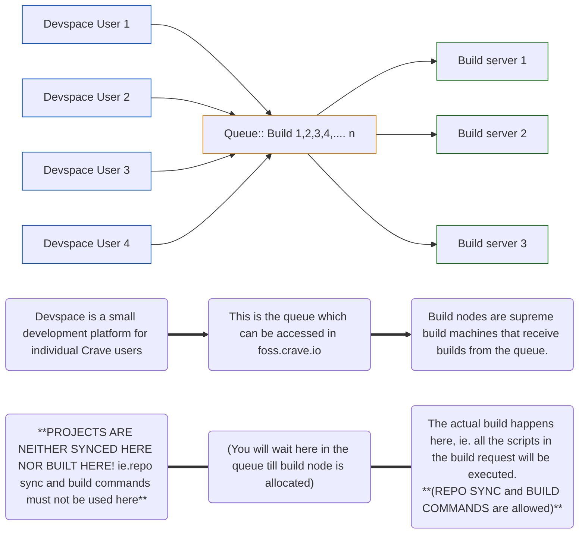

# Building Using Crave Run command

> [!NOTE]
> This section shows you how commands work. Skip to The next half for [how to also clone device sources in there](#Clone-Device-Sources-During-Build)


<!-- (Diagram idea by @subhahbus, converted by [Yuvraaj](https://github.com/Uvatbc))-->
<sub>TODO: Give credit</sub>

Simply use crave run! On a normal server, we'd be running commands one
by one. But since crave uses a queue system, we run all the commands in
one go, and wait for our turn in queue. Then, the build node will
execute our commands, one by one.

- Syntax:

```bash
crave run --no-patch -- "your commands"
```

- If you'd like a clean build, add --clean flag

Note: using clean build will reset the image to default. This means it removes any of your progress e.g. synced dt/or the out folder from previous build and ensures we're back to the default source code of the base project. 

Please avoid doing this needlessly as resyncing and building from takes a lot of time. 

Syntax:

```bash
crave run --clean --no-patch -- "your commands"
```

When you run a build using crave run, it adds you to the build queue,
where a build node comes, picks it up and compiles your build for you!

# Clone Device Sources During Build

Options: officially supported devices, local manifests, sync scripts,
and manual git clone.

- Officially Supported devices: They will automatically clone source
  code through breakfast or brunch commands, just refer to the official
  instructions for your device. You will need proprietary blobs, which
  can usually be found on TheMuppets repositories.

```bash
crave run  --no-patch -- "rm -rf .repo/local_manifests; \
git clone https://github.com/TheMuppets/manifests --depth 1 -b lineage-21.0 .repo/local_manifests; \
/opt/crave/resync.sh; \
source build/envsetup.sh; \
brunch Mi439"   
```

- Local manifests example:

```bash
crave run  --no-patch -- "rm -rf .repo/local_manifests; \
git clone https://github.com/sounddrill31/reponame --depth 1 -b branchname .repo/local_manifests; \
/opt/crave/resync.sh; \
source build/envsetup.sh; \
lunch lineage_oxygen-eng; \
m bacon"   
```

[~marado](https://tilde.pt/~marado/) made an easy to follow guide on
making your own local manifests over at
[tilde.pt](https://tilde.pt/~marado/blog/repo-using-a-local-manifest.html).

You can also use sounddrill's [Generator script](https://github.com/sounddrill31/actions_generate_local_manifests) which works most of the time 

Local manifests rely on repo sync. We have made a simple script to repo
sync while avoiding majority of conflicts which arise due to uncommitted
changes, or when building a different ROM. You can find the source code
to resync.sh
[here](https://github.com/accupara/docker-images/blob/master/aosp/common/resync.sh)

- Git clone example:

```bash
crave run  --no-patch -- "rm -rf device/oem/codename kernel/oem/codename vendor/oem/codename; \
git clone https://github.com/sounddrill31/android_device_oem_codename --depth 1 -b branchname device/oem/codename; \
git clone https://github.com/sounddrill31/android_kernel_oem_codename --depth 1 -b branchname kernel/oem/codename; \
git clone https://github.com/sounddrill31/android_vendor_oem_codename --depth 1 -b branchname vendor/oem/codename; \
source build/envsetup.sh; \
lunch lineage_oxygen-eng; \
m bacon"
```


> [!NOTE]
> This section assumes you're trying to build only Crave-supported ROMs. Skip to The next section if you want to build unsupported ROMs.