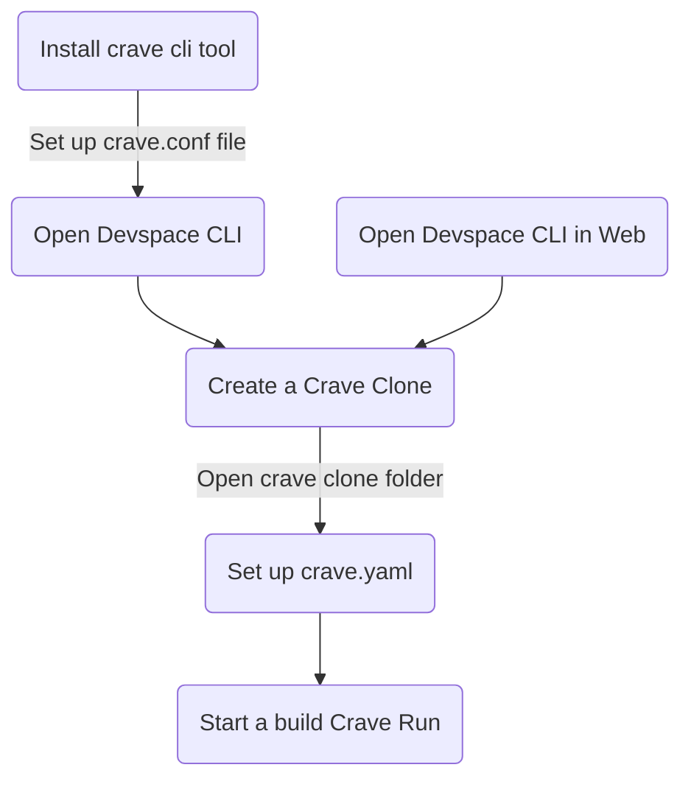

## Introduction

Earlier, Cirrus CI gave the ROM Builders community servers for OSS developement of Android builds, as these builds need a lot of resources that most people don't have lying around, like double digit RAM requirements (GB), triple digit storage requirements (GB), a capable processor, a specific Linux environment, etc.

Cirrus CI has discontinued ROM Builders around Nov 2023. Now, [crave.io](https://crave.io) is providing Build Servers with a pretty similar Queue System. It is also a lot more flexible as it allows custom commands, has Docker image support, allows entering into build storage without starting a build, etc.

This guide attempts to help new and old users with Android development and using crave.io through Devspace CLI and alternatively, Github Actions.

## Getting an account

 Please request an account [here](https://forms.gle/Jhvy9osvdmcS9B7fA) since self-signup is disabled.

Also check out the official [discord](https://discord.crave.io)!

## General Steps
Using Crave.io is a little bit different from using a normal server, mainly because it has a queue system. This wiki expands upon the following process in a step by step manner:

